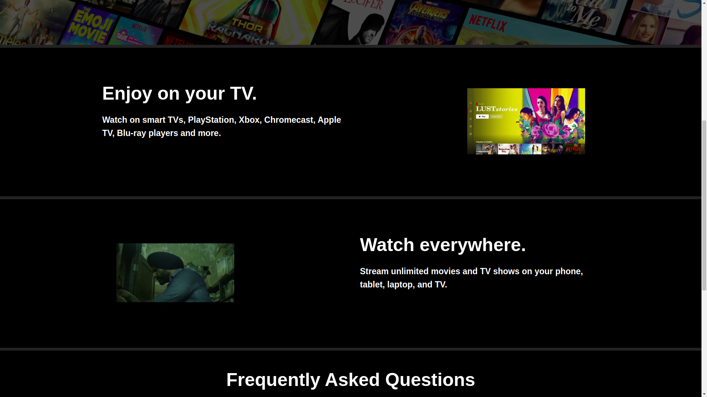

## Netflix Clone

Netflix clone created using ReactJS which is completely responsive. 

## Website Link
To view the website , you can visit [http://localhost:3000](http://localhost:3000) here.

## How to run the website
In project directory , run command `npm start` and you can view the website on [http://localhost:3000](http://localhost:3000) in your browser.

## Images

